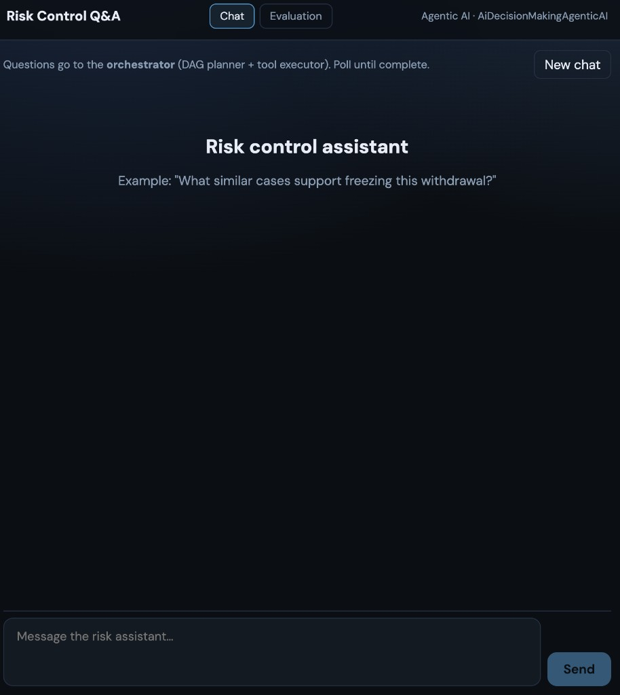
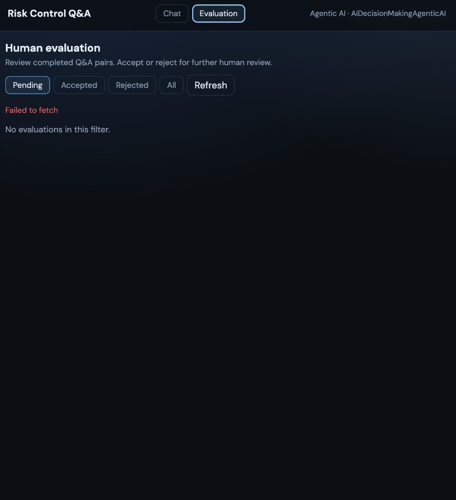

# AI Decision Making — Agentic AI (Backend)

Spring Boot **orchestrator + tool registry** API for risk-control Q&A. Deployed to App Service **`ai-rag-agentic-ai`**. Azure OpenAI chat deployment **`ai-rag-agentic-ai`** on resource **`ai-reg-embedding`**.

Companion UI: **[AiDecisionMakingQAFront](https://github.com/michaelgsx/AiDecisionMakingQAFront)** (SWA **`ai-rag-agentic-qa`**).

> **Synthetic data:** Schema catalog text, seed risk rows, and demo evaluations are AI-generated for development only.

## Screenshots (companion UI)

The **[AiDecisionMakingQAFront](https://github.com/michaelgsx/AiDecisionMakingQAFront)** app consumes this API.

### Chat tab



### Evaluation tab

Post-run human review (`GET /agent/evaluations`, `POST .../review`).



## What it does

1. **Accept** a natural-language question (`POST /agent/ask`).
2. **Plan** a workflow DAG with Azure OpenAI (or use a default DAG).
3. **Validate** the DAG (known tools, no cycles, step limit).
4. **Execute** tools asynchronously via a background worker (~2s poll).
5. **Persist** run + step state in Azure SQL for polling and resume.
6. **Enqueue** completed Q&A for the human **evaluation** queue.

## Architecture

```text
┌─────────────┐     ┌──────────────────┐     ┌─────────────────┐
│  QA Front   │────▶│ OrchestratorEngine│────▶│ Tool executors  │
│  (SWA)      │     │ Planner / Executor│     │ (Spring beans)  │
└─────────────┘     └────────┬─────────┘     └────────┬────────┘
                           │                         │
                           ▼                         ▼
                    orchestrator_*              AiDecision RAG API
                    qa_evaluation               Azure SQL (read-only NL2SQL)
                    schema_catalog_*            Human-in-the-loop (async)
```

Deep dive: [`.ai/12-orchestrator-architecture.md`](./.ai/12-orchestrator-architecture.md)

## Tool registration at startup

On each application start, `ToolRegistryStartup` inserts built-in tools into `orchestrator_tool` **only when the tool name is not already present** (existing rows are left unchanged). Runtime executors are Spring beans implementing `AgentTool`; metadata lives in `BuiltinToolCatalog`.

## Registered tools

| Tool | Mode | Description |
|------|------|-------------|
| `data_acquisition` | SYNC | Load risk context / features |
| `ai_decision_rag` | SYNC | Hybrid search via **AiDecisionMakingBackend** `POST /rag/assess` |
| `similarity_retrieval` | SYNC | Legacy alias → `ai_decision_rag` |
| `natural_language_to_sql` | SYNC | NL → read-only SQL using `schema_catalog_*` |
| `human_in_the_loop` | ASYNC | User accept/reject before workflow continues |
| `llm_answer` | SYNC | Final answer from prior step outputs |

Configure RAG:

```env
APP_RAG_API_BASE_URL=https://<your-backend-app>.azurewebsites.net
APP_RAG_API_OPS_TOKEN=<optional>
```

## API

| Method | Path | Description |
|--------|------|-------------|
| POST | `/agent/ask` | Submit question → `{ runId, status, pollPath }` |
| GET | `/agent/runs/{runId}` | Poll status, steps, `pendingApprovals` |
| POST | `/agent/runs/{runId}/resume` | Resume a **FAILED** run |
| POST | `/agent/runs/{runId}/human-response` | Answer `human_in_the_loop` step |
| GET | `/agent/evaluations?status=pending` | Human review queue (`pending` \| `accepted` \| `rejected` \| `all`) |
| POST | `/agent/evaluations/{evaluationId}/review` | `{ decision: accept\|reject, reviewerId?, comment? }` |
| GET | `/agent/tools` | Tool registry (schemas, SYNC/ASYNC) |
| POST | `/agent/tools` | Register tool metadata (executor must exist) |
| POST | `/agent/feedback` | Thumbs `up` / `down` |
| POST | `/agent/chat` | Legacy: block until complete |
| GET | `/health` | SQL connectivity |

Optional auth: set `OPS_TOKEN`; clients send `Authorization: Bearer <token>`. Blank = open (local dev).

## Database

Shared database **`ai-rag-db-1`** (same server as AiDecisionMakingBackend).

### Migrations

```bash
cd db
pip install -r requirements.txt
cp .env.example .env   # or copy AiDecisionMakingBackend/db/.env
python run_migrations.py
```

| Script | Contents |
|--------|----------|
| V1 | `qa_conversation`, `qa_message`, `qa_feedback` |
| V2 | `orchestrator_tool`, `orchestrator_run`, `orchestrator_step` |
| V3 | `qa_feedback.run_id`, nullable `conversation_id` |
| V4 | `schema_catalog_*`, `orchestrator_human_request` |
| V5 | Seed schema catalog (basic) |
| V6 | Upsert orchestrator tools |
| V7 | `qa_evaluation` (post-run human review) |
| V8 | Full catalog descriptions + demo Q&A / risk / evaluation rows |
| V9 | Fix demo UUIDs + missing tools |

### NL2SQL schema catalog

`schema_catalog_table` and `schema_catalog_column` store **table/column descriptions** for the LLM. Extend these rows for production governance; the NL2SQL tool only allows **SELECT** queries.

## Local run

**Java 17** required.

```bash
cd backend
cp .env.example .env
# Reuse SQL + OpenAI from AiDecisionMakingBackend/backend/.env when possible
export JAVA_HOME=$(/usr/libexec/java_home -v 17)   # macOS
./mvnw spring-boot:run
```

| URL | Purpose |
|-----|---------|
| http://localhost:8788/health | DB check |
| http://localhost:8788/agent/evaluations?status=pending | Evaluation queue |

Port **8788**. CORS default includes `http://localhost:5174`.

## Build JAR

```bash
cd backend
./mvnw clean package -DskipTests -B
# → backend/target/ai-decision-making-agentic-0.1.0-SNAPSHOT.jar
```

## Azure deploy

Workflow: `.github/workflows/deploy-agentic-appservice.yml` (branch **`main`**).

| Resource | Name |
|----------|------|
| App Service | **ai-rag-agentic-ai** |
| OpenAI deployment | **ai-rag-agentic-ai** |
| SQL database | **ai-rag-db-1** |
| QA Static Web App | **ai-rag-agentic-qa** (other repo) |

**GitHub secret:** `AZURE_CREDENTIALS` (Website Contributor on the App Service).

**App Service → Configuration (typical):**

| Setting | Notes |
|---------|--------|
| `AZURE_OPENAI_ENDPOINT` | e.g. `https://ai-reg-embedding.openai.azure.com` |
| `AZURE_OPENAI_API_KEY` | Key Vault reference recommended |
| `AZURE_OPENAI_CHAT_DEPLOYMENT` | `ai-rag-agentic-ai` |
| `AZURE_SQL_*` | Server, database, user, password |
| `APP_RAG_API_BASE_URL` | AiDecisionMakingBackend URL |
| `CORS_ORIGINS` | `https://<swa-host>.azurestaticapps.net`, `http://localhost:5174` |
| `OPS_TOKEN` | Match QA `VITE_OPS_TOKEN` |
| `WEBSITES_PORT` | `8788` |

Runtime: **Java 17** (Linux).

## Repo layout

```text
backend/          # Spring Boot application (port 8788)
db/               # SQL migrations + run_migrations.py
.ai/              # Architecture notes
```

## Related repos

| Repo | Role |
|------|------|
| **AiDecisionMakingQAFront** | Chat + Evaluation UI |
| AiDecisionMakingBackend | RAG assess, risk ingest tables |
| AiDecisionMakingFrontend | Risk operations console |
| AiDecisionMakingML | Batch ML / feature bins |
