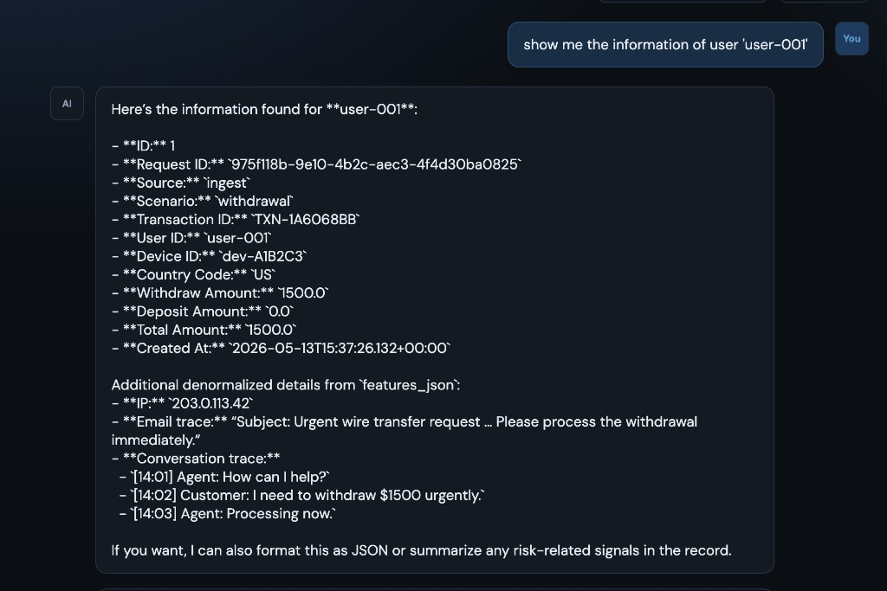
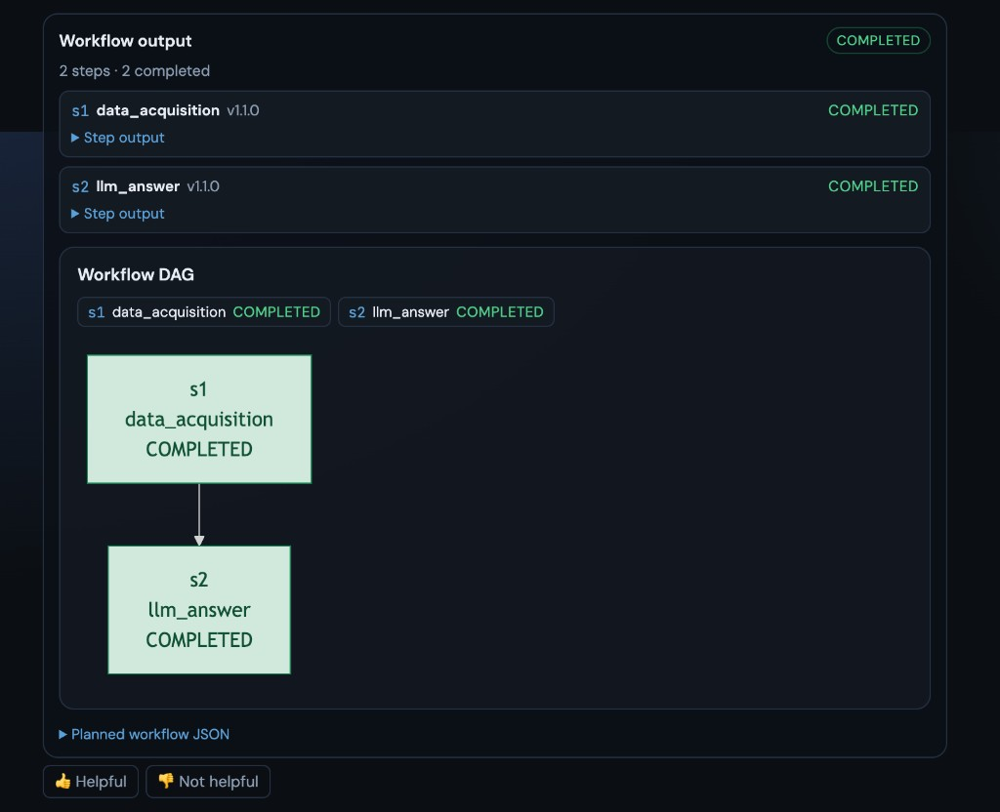

# AI Decision Making — Agentic AI (Backend)

Spring Boot **orchestrator + tool registry** API for risk-control Q&A. Deployed to App Service **`ai-rag-agentic-ai`**. Azure OpenAI chat deployment **`gpt-5.4-mini`** on resource **`ai-reg-embedding`** (same as `ai-rag-webapp`).

Companion UI: **[AiDecisionMakingQAFront](https://github.com/michaelgsx/AiDecisionMakingQAFront)** (SWA **`ai-rag-agentic-qa`**).

**🔗 Live demo (UI):** https://yellow-island-0fefe051e.7.azurestaticapps.net/

**🎬 Demo video** — agentic Q&A UI walkthrough (planner → tools → answer + workflow diagram).

**[▶ Watch on YouTube](https://www.youtube.com/watch?v=AGwshtB56CA)**

[](https://www.youtube.com/watch?v=AGwshtB56CA)

> **Synthetic data:** Schema catalog text, seed risk rows, and demo evaluations are AI-generated for development only.

## Orchestrator capabilities

The orchestrator is implemented end-to-end:

| Capability | What it does | Where |
|------------|--------------|-------|
| **Workflow cache** | Reuses a thumbs-up-approved DAG for the same question (skips LLM planner). Entries are written only on `POST /agent/feedback` with `rating=up`, not at plan time. | `PlannerWorkflowCacheService`, `planner_workflow_cache`, `QaFeedbackService` |
| **Compound expander** | After planning, rule-based split of multi-intent questions into N parallel `natural_language_to_sql` steps when the LLM under-split. | `CompoundQuestionDecomposer`, `CompoundWorkflowExpander` |
| **Planner** | Azure OpenAI builds a tool DAG from the question + tool registry (JSON-only contract), with a default-DAG fallback. | `WorkflowPlannerService`, `WorkflowPlannerPromptBuilder` |
| **Executor** | Runs the DAG wave-by-wave, dependency-ordered, invoking each tool over HTTP at its `endpointUrl`; adaptive retries and async (poll / human-in-the-loop) steps. | `WorkflowExecutor`, `WorkflowStepRunner`, `HttpToolInvoker` |
| **Validator** | Validates the DAG before execution: registry-only tools, unique ids, acyclic deps, `llm_answer` last, step limit. | `WorkflowDagValidator`, `WorkflowValidationService` |
| **Status management** | Tracks a fine-grained phase per run (`planning → executing/{step}/{tool} → llm-answering → done/failed`) for both sync and async calls. | `AsyncChatStatusService`, `async_chat_status`, derived `statusDetail` on `GET /agent/runs/{runId}` |
| **Dead-task revival** | Sweeps `async_chat_status` for zombie tasks (non-terminal status with no `updated_at` progress within `stale-task-threshold-ms`, default 5m); atomically bumps `updated_at` to claim the row, then re-drives `processRun` so crashed workers or deploys do not leave runs stuck. `OrchestratorWorker` also polls `PLANNING` runs. | `DeadTaskRevivalWorker`, `AsyncChatStatusService.claimForRevival`, `app.orchestrator.stale-task-threshold-ms` |
| **User table ACL** | SQL tools consult `user_table_access` before `schema_catalog_*` (no userId → default `admin`, seeded with all enabled tables in V19). | `UserTableAccessService`, `user_table_access`, wired in `DataAcquisitionService` + `LlmSqlGenerationService` |
| **Adaptive retry** | Per-step retry budget from `orchestrator_tool.max_retry` (`orchestrator_step.attempt_count` resets to **0** on success, increments on failure). Before blind retry, `StepFailureClassifier` inspects the error: **context too large** → `WorkflowContextSummarizer` compresses upstream step outputs into `_summarizedPriorOutputs` and re-queues; **database connection / permission** → fail immediately with a user-facing message (no retry); other transient errors retry until `retry > max_retry`, then the run fails with the step error surfaced on poll. | `WorkflowStepRunner`, `StepFailureClassifier`, `WorkflowContextSummarizer`, `orchestrator_step.attempt_count`, `orchestrator_tool.max_retry` |
| **Step observability** | Persists every step's status, attempts, inputs/outputs, timings, and errors; exposes them plus a live Mermaid DAG for polling. This is the **auditability** foundation — a durable, queryable trail of *what* ran, *when*, and *with what outcome* for each orchestrator run. | `orchestrator_step`, `orchestrator_run`, `OrchestratorRunAssembler`, `GET /agent/runs/{runId}` + `/workflow-diagram` |
| **Human evaluation queue** | On run completion, enqueues **end-to-end** (`RUN`) and **per-step** (`STEP`) rows in `qa_evaluation` for accept/reject review. Each row stores a **confidence** (0–1) parsed from tool output JSON; LLM tools (`llm_answer`, `data_acquisition` phase-1) emit `confidence` in their response schema when missing. | `QaEvaluationService`, `qa_evaluation`, `GET /agent/evaluations`, `EvaluationConfidenceExtractor` |

### Next step

- **Authentication control** — per-user/role access to runs, tools, and the evaluation queue (today the API uses an optional shared `OPS_TOKEN` bearer; the next iteration adds proper authn).
- **Short / long-term memory strategy** — how the orchestrator retains and recalls context across turns (conversation-scoped short-term state vs. durable long-term knowledge for planning and tool execution).

## Screenshots

The companion **[AiDecisionMakingQAFront](https://github.com/michaelgsx/AiDecisionMakingQAFront)** UI drives this orchestrator. A `user-001` lookup below is planned and executed end-to-end (`data_acquisition` → `llm_answer`).

### Ask a question

`POST /agent/ask` → the planner builds a DAG, the worker runs the tools, and `llm_answer` produces the final text.



### Workflow output (steps + DAG)

Each `orchestrator_step` status, the Mermaid **Workflow DAG** from `orchestrator_run.workflow_json`, and 👍 / 👎 feedback (`POST /agent/feedback`).



### Companion UI tabs and chat modes

Chat / Evaluation / Tools tabs, and Sync (`/agent/ask` + run polling) vs Async (`/agent/async-chat` + status polling) chat modes.


## What it does

1. **Accept** a natural-language question (`POST /agent/ask`).
2. **Plan** a workflow DAG with Azure OpenAI (or use a default DAG).
3. **Validate** the DAG (known tools, no cycles, step limit).
4. **Execute** tools asynchronously via a background worker (~2s poll).
5. **Persist** run + step state in Azure SQL for polling and resume.
6. **Enqueue** completed Q&A for the human **evaluation** queue.

## Architecture

```text
┌─────────────┐     ┌──────────────────┐     ┌─────────────────┐
│  QA Front   │────▶│ OrchestratorEngine│────▶│ Tool executors  │
│  (SWA)      │     │ Planner / Executor│     │ (Spring beans)  │
└─────────────┘     └────────┬─────────┘     └────────┬────────┘
                           │                         │
                           ▼                         ▼
                    orchestrator_*              AiDecision RAG API
                    qa_evaluation               Azure SQL (read-only NL2SQL)
                    schema_catalog_*            Human-in-the-loop (async)
```

Deep dive: [`.ai/12-orchestrator-architecture.md`](./.ai/12-orchestrator-architecture.md)

## LLM workflow planning (examples)

When `POST /agent/ask` is received, `WorkflowPlannerService` loads **all enabled rows** from `orchestrator_tool` (the tool registry), serializes them as JSON, and asks the LLM to **CREATE a workflow DAG** for the user question. The model returns **JSON only** (`response_format: json_object`). That JSON is validated and stored on `orchestrator_run.workflow_json`.

Implementation: `backend/src/main/java/com/aidecision/agentic/orchestrator/WorkflowPlannerService.java`

### Example user question (`userQuestion`)

```text
Should we freeze this $15k withdrawal? User user-demo-001 had a new device yesterday.
```

### System message (task + output contract)

The system prompt explicitly tells the model to **create a complete execution workflow (DAG)** and lists planning rules (registry-only tools, acyclic deps, `llm_answer` last, when to use RAG / NL2SQL / human-in-the-loop).

```text
You are the workflow planner for a risk-control agent orchestrator.

Your task: given a user question and the TOOL REGISTRY (orchestrator_tool),
CREATE a complete execution workflow — a directed acyclic graph (DAG) of tool steps
that answers the question. Output ONLY one JSON object (no markdown, no commentary).

Required output shape:
{ "steps": [ { "id": "s1", "tool": "<toolName from registry>", "dependsOn": [], "params": { }, ... } ] }

Planning rules:
1. Use ONLY toolName values present in toolRegistry (enabled tools).
2. Every step.id must be unique; dependsOn must be acyclic.
3. params must match requestSchema — read each property's description for values and branching.
4. Use responseSchema property descriptions (e.g. aiLabel, accepted, rowCount) for later steps / conditional paths.
5. Last step should be llm_answer when possible; max 20 steps.
```

### User message (`toolRegistry` from `orchestrator_tool`)

The user message includes **`userQuestion`** plus **`toolRegistry`**: a JSON array of all enabled tools. Each tool's `requestSchema` and `responseSchema` are JSON Schema objects where **every property has a `description`** (stored in `orchestrator_tool`, sourced from `ToolJsonSchemas.java` at startup). The planner uses those descriptions to fill `params` and to reason about if/else (e.g. branch on `aiLabel` or `accepted`).

At runtime the array has **all 6 tools** (sorted by `toolName`). Below: two full entries as sent to the LLM; the other four follow the same pattern (`data_acquisition`, `similarity_retrieval`, `natural_language_to_sql`, `llm_answer`).

```text
Create the workflow DAG for the following user question.

userQuestion:
Should we freeze this $15k withdrawal? User user-demo-001 had a new device yesterday.

toolRegistry (from orchestrator_tool — use only these tools):
```

**Example registry entry — `ai_decision_rag` (every request/response field documented):**

```json
{
  "toolName": "ai_decision_rag",
  "version": "1.1.0",
  "toolType": "SIMILARITY_RETRIEVAL",
  "executionMode": "SYNC",
  "description": "AiDecisionMakingBackend hybrid RAG assess for similar cases.",
  "requestSchema": {
    "type": "object",
    "description": "Similar-case search inputs (legacy tool; same as ai_decision_rag).",
    "properties": {
      "query": {
        "type": "string",
        "description": "Natural-language case text to find similar historical cases. Alias for text."
      },
      "text": {
        "type": "string",
        "description": "Case notes / question text sent to RAG assess."
      },
      "metadata": {
        "type": "string",
        "description": "JSON string of case metadata (user_id, scenario, transaction_id) for hybrid search."
      }
    }
  },
  "responseSchema": {
    "type": "object",
    "description": "AiDecision RAG assess result; use aiLabel and hits for branching.",
    "properties": {
      "query": { "type": "string", "description": "Echo of the search text." },
      "risk": { "type": "string", "description": "Coarse risk level from search (e.g. high, medium, low)." },
      "searchReason": { "type": "string", "description": "Short Azure AI Search summary (not full LLM write-up)." },
      "aiLabel": {
        "type": "string",
        "description": "Model recommendation: passed | rejected | frozen. Use for if/else before human_in_the_loop."
      },
      "aiReason": { "type": "string", "description": "Full analyst-style explanation from LLM when configured." },
      "hits": {
        "type": "array",
        "description": "Similar records: recordId, score, snippet, reviewOutcome, scenario."
      },
      "summary": { "type": "string", "description": "One-line tool summary for logs." },
      "source": { "type": "string", "description": "AiDecisionMakingBackend or demo." }
    }
  }
}
```

**Example registry entry — `human_in_the_loop` (branch on `accepted` in responseSchema):**

```json
{
  "toolName": "human_in_the_loop",
  "version": "1.1.0",
  "toolType": "VALIDATION",
  "executionMode": "ASYNC",
  "description": "Async user approval: is the proposed solution acceptable?",
  "requestSchema": {
    "type": "object",
    "description": "Async human approval before final answer.",
    "properties": {
      "prompt": {
        "type": "string",
        "description": "Question shown to the reviewer in the QA UI (e.g. Is this freeze acceptable?)."
      },
      "proposal": {
        "type": "string",
        "description": "Full proposed action text; defaults to concatenated prior step outputs if omitted."
      }
    }
  },
  "responseSchema": {
    "type": "object",
    "description": "After user responds via POST /agent/runs/{runId}/human-response.",
    "properties": {
      "requestId": { "type": "string", "description": "UUID for the human request row." },
      "stepKey": { "type": "string", "description": "Workflow step id this approval belongs to." },
      "prompt": { "type": "string", "description": "Prompt shown to the user." },
      "proposal": { "type": "string", "description": "Proposal text that was reviewed." },
      "status": { "type": "string", "description": "WAITING until answered, then ANSWERED." },
      "decision": {
        "type": "string",
        "description": "accept | reject after user responds. Use for branching to llm_answer tone."
      },
      "accepted": {
        "type": "boolean",
        "description": "true if decision=accept; false if reject. Primary branch flag."
      },
      "comment": { "type": "string", "description": "Optional reviewer comment." },
      "summary": { "type": "string", "description": "Short outcome summary." }
    }
  }
}
```

**Other tools in the same array (each property also has `description`):**

| toolName | requestSchema highlights | responseSchema highlights (for branching) |
|----------|--------------------------|----------------------------------------|
| `data_acquisition` | `scenario` — risk use-case id | `features`, `note` |
| `similarity_retrieval` | same as `ai_decision_rag` | same as `ai_decision_rag` |
| `natural_language_to_sql` | `question`, `maxRows` | `rowCount` — 0 vs non-empty |
| `llm_answer` | (empty object) | `answer` — final text |

Canonical definitions: `backend/src/main/java/com/aidecision/agentic/tool/ToolJsonSchemas.java`. Inspect live registry: `GET /agent/tools/ai_decision_rag/1.1.0/registry-info`.

### Example Azure OpenAI request body

`POST {AZURE_OPENAI_ENDPOINT}/openai/deployments/gpt-5.4-mini/chat/completions?api-version=2024-02-01`

```json
{
  "temperature": 0.1,
  "max_tokens": 4096,
  "response_format": { "type": "json_object" },
  "messages": [
    { "role": "system", "content": "<planner system prompt — CREATE workflow DAG + rules>" },
    { "role": "user", "content": "<Create the workflow DAG… + userQuestion + toolRegistry JSON array>" }
  ]
}
```

### Example LLM response (assistant `content`)

Illustrative JSON the planner expects (field names must match; no markdown fences):

```json
{
  "steps": [
    {
      "id": "s1",
      "tool": "data_acquisition",
      "dependsOn": [],
      "params": { "scenario": "withdrawal_review" },
      "maxTimeMs": 30000,
      "timeoutMs": 120000
    },
    {
      "id": "s2",
      "tool": "ai_decision_rag",
      "dependsOn": ["s1"],
      "params": {
        "text": "Should we freeze this $15k withdrawal? User user-demo-001 had a new device yesterday.",
        "metadata": "{\"user_id\":\"user-demo-001\",\"scenario\":\"withdrawal_spike\"}"
      },
      "maxTimeMs": 30000,
      "timeoutMs": 120000
    },
    {
      "id": "s3",
      "tool": "human_in_the_loop",
      "dependsOn": ["s1", "s2"],
      "params": {
        "prompt": "Is this freeze recommendation acceptable?",
        "proposal": "Recommend freeze pending review based on similar cases and new device."
      },
      "maxTimeMs": 30000,
      "timeoutMs": 300000
    },
    {
      "id": "s4",
      "tool": "llm_answer",
      "dependsOn": ["s1", "s2", "s3"],
      "params": {},
      "maxTimeMs": 30000,
      "timeoutMs": 120000
    }
  ]
}
```

### Persisted on the run (`orchestrator_run.workflow_json`)

After planning, the same structure is saved (serialized `WorkflowDag`):

```json
{
  "steps": [
    { "id": "s1", "tool": "data_acquisition", "dependsOn": [], "params": { "scenario": "withdrawal_review" }, "maxTimeMs": 30000, "timeoutMs": 120000 },
    { "id": "s2", "tool": "ai_decision_rag", "dependsOn": ["s1"], "params": { "text": "Should we freeze...", "metadata": "{\"user_id\":\"user-demo-001\"}" }, "maxTimeMs": 30000, "timeoutMs": 120000 },
    { "id": "s3", "tool": "human_in_the_loop", "dependsOn": ["s1", "s2"], "params": { "prompt": "Is this freeze recommendation acceptable?", "proposal": "Recommend freeze..." }, "maxTimeMs": 30000, "timeoutMs": 300000 },
    { "id": "s4", "tool": "llm_answer", "dependsOn": ["s1", "s2", "s3"], "params": {}, "maxTimeMs": 30000, "timeoutMs": 120000 }
  ]
}
```

Each step becomes a row in `orchestrator_step` (`step_key` = `id`, `tool_name` = `tool`, `depends_on_json`, `input_json` = `params`).

### Workflow diagram (Mermaid)

The API can turn the same JSON into a **Mermaid flowchart** (nodes = steps, edges = `dependsOn`). Step execution status from a run is applied as node colors when available.

## Workflow executor and condition gates

The **executor** (`WorkflowExecutor` + `WorkflowStepRunner`) runs the planned DAG:

1. **Tool steps** (`type: "tool"` or omitted) — invoke a registry tool by name via HTTP (`HttpToolInvoker`) or in-process `AgentTool`. Inputs come from `params` (must match the tool `requestSchema`). Output is JSON stored on `orchestrator_step.output_json` (shape described by `responseSchema`).
2. **Gate steps** (`type: "gate"`) — runtime **if/else**; no HTTP call. After dependencies complete, the executor evaluates `expression` against prior step outputs, marks the gate `COMPLETED`, and sets the untaken branch to `SKIPPED` (including downstream steps that depend on skipped nodes).

### Tool registry (dynamic metadata)

Each row in `orchestrator_tool` carries:

| Field | Purpose |
|-------|---------|
| `tool_name`, `version` | Step `tool` must match an enabled row |
| `endpoint_url` | `POST …/execute` (and `/poll` for ASYNC) |
| `request_schema_json` / `response_schema_json` | Planner + documentation; executor stores raw JSON I/O |
| `max_retry` | Per-step retry budget (`orchestrator_step.attempt_count`) |
| `execution_mode` | `SYNC` or `ASYNC` |

Register via `POST /agent/tools` or startup sync from `BuiltinToolCatalog`. Built-ins also have Spring `AgentTool` beans; production can set `app.orchestrator.invoke-tools-over-http=true` so every tool is URL-addressable.

### Gate step shape

```json
{
  "id": "g1",
  "type": "gate",
  "dependsOn": ["s1"],
  "expression": "steps.s1.output.rowCount > 5",
  "then": ["s2"],
  "else": ["s3"]
}
```

| Field | Description |
|-------|-------------|
| `type` | Must be `"gate"` |
| `dependsOn` | Steps whose `output_json` the expression reads (usually the step immediately upstream) |
| `expression` | Condition on prior outputs (see below) |
| `then` | Step ids to **keep** when expression is **true** |
| `else` | Step ids to **keep** when expression is **false** |

Branch tool steps should list the gate in `dependsOn`, e.g. `"dependsOn": ["g1"]`. Untaken roots and their descendants are marked `SKIPPED`. A run completes when every step is `COMPLETED` or `SKIPPED`.

### Expression syntax (v1)

| Form | Example |
|------|---------|
| Numeric compare | `steps.s1.output.rowCount > 5` |
| Equality (string) | `steps.s2.output.aiLabel == 'frozen'` |
| Equality (boolean) | `steps.s3.output.accepted == true` |
| Truthy field | `steps.s3.output.accepted` |

Use field names from each tool's **responseSchema** in `orchestrator_tool`. Gate output is JSON: `{ "branch": "then"|"else", "result": true|false, "expression": "…", "takenSteps": [], "skippedSteps": [] }`.

### Copy-paste runnable example (gate + NL2SQL)

Valid against built-in tools (`natural_language_to_sql`, `llm_answer`). Save as `workflow-gate-example.json` or paste into `workflow.html`.

```json
{
  "steps": [
    {
      "id": "s1",
      "tool": "natural_language_to_sql",
      "dependsOn": [],
      "params": {
        "question": "How many distinct user ids are in risk_features?",
        "maxRows": 100
      },
      "maxTimeMs": 30000,
      "timeoutMs": 120000
    },
    {
      "id": "g1",
      "type": "gate",
      "dependsOn": ["s1"],
      "expression": "steps.s1.output.rowCount > 0",
      "then": ["s2"],
      "else": ["s3"]
    },
    {
      "id": "s2",
      "tool": "llm_answer",
      "dependsOn": ["g1", "s1"],
      "params": {},
      "maxTimeMs": 30000,
      "timeoutMs": 120000
    },
    {
      "id": "s3",
      "tool": "llm_answer",
      "dependsOn": ["g1"],
      "params": {},
      "maxTimeMs": 30000,
      "timeoutMs": 120000
    }
  ]
}
```

**What happens at runtime**

| `s1` result | Runs | Skipped |
|-------------|------|---------|
| `rowCount > 0` | `g1` → `s2` | `s3` |
| `rowCount == 0` | `g1` → `s3` | `s2` |

**Validate and render (local API on port 8788)**

```bash
# 1) Check DAG (acyclic, known tools, execution waves)
curl -sS -X POST http://localhost:8788/agent/workflow/validate \
  -H 'Content-Type: application/json' \
  -d "$(jq -nc --rawfile w workflow-gate-example.json '{workflowJson: $w}')"

# 2) Mermaid diagram
curl -sS -X POST http://localhost:8788/agent/workflow/diagram \
  -H 'Content-Type: application/json' \
  -d "$(jq -nc --rawfile w workflow-gate-example.json '{workflowJson: $w}')"
```

If `OPS_TOKEN` is set, add `-H "Authorization: Bearer $OPS_TOKEN"`.

The planner may emit a similar DAG for compound analytics questions; you can also inspect a live run via `GET /agent/runs/{runId}` → `workflowJson` / `workflowMermaid` after `POST /agent/ask`.

Implementation: `GateConditionEvaluator`, `WorkflowGateRunner`, `WorkflowExecutor`.

Gate nodes render in Mermaid as `gate` with the expression snippet; `SKIPPED` steps use the grey style class.

### Workflow diagram API

| Method | Path | Description |
|--------|------|-------------|
| POST | `/agent/workflow/diagram` | Body: `{ "workflowJson": "<string>", "stepStatuses": { "s1": "COMPLETED", ... } }` (statuses optional) → `{ "format": "mermaid", "mermaid": "..." }` |
| GET | `/agent/runs/{runId}/workflow-diagram` | Diagram for the run’s stored `workflow_json` + live `orchestrator_step` statuses |

`GET /agent/runs/{runId}` also includes **`workflowMermaid`** when `workflow_json` is present.

**Browser viewer (local):** open `http://localhost:8788/workflow.html` — paste JSON or enter a `runId`, then render.

Example `POST /agent/workflow/diagram`:

```json
{
  "workflowJson": "{\"steps\":[{\"id\":\"s1\",\"tool\":\"data_acquisition\",\"dependsOn\":[],\"params\":{}},{\"id\":\"s2\",\"tool\":\"llm_answer\",\"dependsOn\":[\"s1\"],\"params\":{}}]}"
}
```

### Analytics-style question (NL2SQL in the DAG)

**Question:** `How many ingest cases were rejected for login_anomaly last month?`

**Example LLM workflow:**

```json
{
  "steps": [
    {
      "id": "s1",
      "tool": "natural_language_to_sql",
      "dependsOn": [],
      "params": { "question": "How many ingest cases were rejected for login_anomaly last month?", "maxRows": 100 },
      "maxTimeMs": 30000,
      "timeoutMs": 120000
    },
    {
      "id": "s2",
      "tool": "llm_answer",
      "dependsOn": ["s1"],
      "params": {},
      "maxTimeMs": 30000,
      "timeoutMs": 120000
    }
  ]
}
```

### Fallback when OpenAI is unavailable

If chat is not configured or planning fails validation, a fixed default DAG is used:

```json
{
  "steps": [
    { "id": "s1", "tool": "data_acquisition", "dependsOn": [], "params": { "scenario": "qa" }, "maxTimeMs": 30000, "timeoutMs": 120000 },
    { "id": "s2", "tool": "ai_decision_rag", "dependsOn": ["s1"], "params": { "text": "<original question>" }, "maxTimeMs": 30000, "timeoutMs": 120000 },
    { "id": "s3", "tool": "llm_answer", "dependsOn": ["s1", "s2"], "params": {}, "maxTimeMs": 30000, "timeoutMs": 120000 }
  ]
}
```

## Tool registration at startup

On each application start, `ToolRegistryStartup` syncs `BuiltinToolCatalog` into `orchestrator_tool`:

- **New tool** → insert row.
- **Existing tool** → update `description`, `request_schema_json`, and `response_schema_json` (every property in those schemas has a **`description`** field so the workflow planner can branch on `aiLabel`, `accepted`, `rowCount`, etc.).

Source: `ToolJsonSchemas.java` + `BuiltinToolCatalog.java`. Runtime executors are Spring `AgentTool` beans.

## Registered tools

Per-tool docs: [`docs/tools/`](./docs/tools/README.md).

| Tool | Mode | Description |
|------|------|-------------|
| `data_acquisition` | SYNC | Two-phase LLM: `schema_catalog_table` index → pick tables → columns + `schema_catalog_foreign_key` → SQL → context rows |
| `ai_decision_rag` | SYNC | Hybrid search via **AiDecisionMakingBackend** `POST /rag/assess` |
| `similarity_retrieval` | SYNC | Legacy alias → `ai_decision_rag` |
| `natural_language_to_sql` | SYNC | NL → read-only SQL using `schema_catalog_*` |
| `human_in_the_loop` | ASYNC | User accept/reject before workflow continues |
| `llm_answer` | SYNC | Final answer from prior step outputs |

Configure RAG:

```env
APP_RAG_API_BASE_URL=https://<your-backend-app>.azurewebsites.net
APP_RAG_API_OPS_TOKEN=<optional>
```

## Per-tool REST API

Each built-in tool has its own `@RestController` under `/agent/tools/{tool_name}/{version}` with the same four endpoints. The `version` path segment must match the row in `orchestrator_tool` (currently **1.1.0** for all built-ins).

| Method | Path suffix | Description |
|--------|-------------|-------------|
| GET | `/registry-info` | Row from `orchestrator_tool` + parsed request/response schemas |
| POST | `/execute` | Run the tool once (`ToolExecuteRequest`: `params`, `question`, optional `runId`, `stepKey`, `priorOutputsByStepKey`) |
| POST | `/poll` | **ASYNC only** — pass `priorOutput` from a pending `/execute` (e.g. `human_in_the_loop`) |
| POST | `/cancel` | **`human_in_the_loop` only** — cancel a WAITING request (`requestId` or `runId` + `stepKey`) |

Controllers: `backend/src/main/java/com/aidecision/agentic/controller/tool/`

| Tool | Base path (example version `1.1.0`) |
|------|-----------|
| data_acquisition | `/agent/tools/data_acquisition/1.1.0` |
| similarity_retrieval | `/agent/tools/similarity_retrieval/1.1.0` |
| ai_decision_rag | `/agent/tools/ai_decision_rag/1.1.0` |
| natural_language_to_sql | `/agent/tools/natural_language_to_sql/1.1.0` |
| human_in_the_loop | `/agent/tools/human_in_the_loop/1.1.0` |
| llm_answer | `/agent/tools/llm_answer/1.1.0` |

Example — data acquisition (schema catalog → SQL → rows):

```http
POST /agent/tools/data_acquisition/1.1.0/execute
Content-Type: application/json

{
  "question": "What risk context exists for user user-demo-001 on recent withdrawals?",
  "params": {
    "scenario": "withdrawal_review",
    "question": "What risk context exists for user user-demo-001 on recent withdrawals?",
    "maxRows": 20
  }
}
```

Example — execute RAG:

```http
POST /agent/tools/ai_decision_rag/1.1.0/execute
Content-Type: application/json

{
  "question": "Should we freeze this withdrawal?",
  "params": {
    "text": "Should we freeze this withdrawal?",
    "metadata": "{\"user_id\":\"user-demo-001\"}"
  }
}
```

Example — poll human step (after async execute):

```http
POST /agent/tools/human_in_the_loop/1.1.0/poll
{ "priorOutput": { "requestId": "...", "status": "WAITING" }, "runId": "...", "stepKey": "s3" }
```

### Orchestrator execute + async feedback

**`POST /agent/execute`** runs sync steps immediately. If the DAG hits an async tool:

- **`INPUT_REQUIRED`** (e.g. `human_in_the_loop`) → response includes `pendingAsync[]` with `requestId`, `stepKey`, `toolName`, `toolVersion`, `allowedDecisions`, `feedbackPath`.
- **`POLL_ONLY`** (slow tools, no user input) → `pendingAsync[]` with `pollPath`; client calls **`POST /agent/runs/{runId}/poll`**.

When every tool is SYNC, `completed: true` and `answer` are set in the same response.

```http
POST /agent/execute
{ "question": "Should we freeze this withdrawal?", "userId": "user-demo-001", "transactionId": "tx-123" }
```

```json
{
  "runId": "...",
  "workflowId": "...",
  "status": "WAITING_ASYNC",
  "completed": false,
  "waitingForAsync": true,
  "pendingAsync": [{
    "requestId": "...",
    "stepKey": "s3",
    "toolName": "human_in_the_loop",
    "toolVersion": "1.1.0",
    "asyncKind": "INPUT_REQUIRED",
    "prompt": "Is this freeze acceptable?",
    "proposal": "Recommend freeze...",
    "allowedDecisions": ["accept", "reject"],
    "feedbackPath": "/agent/runs/.../feedback"
  }],
  "pollPath": "/agent/runs/...",
  "feedbackPath": "/agent/runs/.../feedback"
}
```

```http
POST /agent/runs/{runId}/feedback
{
  "requestId": "...",
  "stepKey": "s3",
  "userId": "user-demo-001",
  "toolName": "human_in_the_loop",
  "toolVersion": "1.1.0",
  "result": "accept",
  "comment": "Looks correct"
}
```

## API

| Method | Path | Description |
|--------|------|-------------|
| POST | `/agent/ask` | Submit question → `{ runId, status, pollPath }` (async worker) |
| POST | `/agent/execute` | Run inline: full answer if all SYNC; else `pendingAsync` handles |
| GET | `/agent/runs/{runId}` | Poll status, steps, `workflowJson`, `workflowMermaid`, `pendingAsync` |
| POST | `/agent/runs/{runId}/feedback` | **INPUT_REQUIRED** async tools (`requestId`, `stepKey`, `result`, `toolName`, `userId`, …) |
| POST | `/agent/runs/{runId}/poll` | **POLL_ONLY** async tools (no user input) |
| GET | `/agent/runs/{runId}/workflow-diagram` | Mermaid flowchart for the run DAG |
| POST | `/agent/workflow/diagram` | Mermaid from arbitrary workflow JSON |
| POST | `/agent/runs/{runId}/resume` | Resume a **FAILED** run |
| POST | `/agent/runs/{runId}/human-response` | Legacy alias → `/feedback` for `human_in_the_loop` |
| GET | `/agent/evaluations?status=pending` | Human review queue (`pending` \| `accepted` \| `rejected` \| `all`) |
| POST | `/agent/evaluations/{evaluationId}/review` | `{ decision: accept\|reject, reviewerId?, comment? }` |
| GET | `/agent/tools` | Tool registry (schemas, SYNC/ASYNC) |
| POST | `/agent/tools` | Register tool metadata (executor must exist) |
| POST | `/agent/feedback` | Thumbs `up` / `down`; `up` on a completed run caches question + workflow for planner reuse |
| POST | `/agent/chat` | Legacy: block until complete |
| GET | `/health` | SQL connectivity |

Optional auth: set `OPS_TOKEN`; clients send `Authorization: Bearer <token>`. Blank = open (local dev).

## Database

Shared database **`ai-rag-db-1`** (same server as AiDecisionMakingBackend).

### Migrations

```bash
cd db
pip install -r requirements.txt
cp .env.example .env   # or copy AiDecisionMakingBackend/db/.env
python run_migrations.py
```

| Script | Contents |
|--------|----------|
| V1 | `qa_conversation`, `qa_message`, `qa_feedback` |
| V2 | `orchestrator_tool`, `orchestrator_run`, `orchestrator_step` |
| V3 | `qa_feedback.run_id`, nullable `conversation_id` |
| V4 | `schema_catalog_*`, `orchestrator_human_request` |
| V5 | Seed schema catalog (basic) |
| V6 | Upsert orchestrator tools |
| V7 | `qa_evaluation` (post-run human review) |
| V8 | Full catalog descriptions + demo Q&A / risk / evaluation rows |
| V9 | Fix demo UUIDs + missing tools |
| V11 | Human request `EXPIRED` status (tool cancel API) |
| V9 | Fix demo UUIDs + missing tools |

### NL2SQL schema catalog

`schema_catalog_table` and `schema_catalog_column` store **table/column descriptions** for the LLM. Extend these rows for production governance; the NL2SQL tool only allows **SELECT** queries.

## Local run

**Java 17** required.

```bash
cd backend
cp .env.example .env
# Reuse SQL + OpenAI from AiDecisionMakingBackend/backend/.env when possible
export JAVA_HOME=$(/usr/libexec/java_home -v 17)   # macOS
./mvnw spring-boot:run
```

| URL | Purpose |
|-----|---------|
| http://localhost:8788/health | DB check |
| http://localhost:8788/agent/evaluations?status=pending | Evaluation queue |

Port **8788**. CORS default includes `http://localhost:5174`.

## Unit tests

```bash
cd backend
./mvnw test
```

Covers workflow DAG validation, Mermaid rendering, schema catalog / data acquisition / NL2SQL, tool registry & operations, adaptive step retry, dead-task revival, user table ACL, and workflow diagram REST (`@WebMvcTest`).

## Build JAR

```bash
cd backend
./mvnw clean package -DskipTests -B
# → backend/target/ai-decision-making-agentic-0.1.0-SNAPSHOT.jar
```

## Azure deploy

**Use GitHub Actions only** — `.github/workflows/deploy-agentic-appservice.yml` on push to **`v1`** or **`main`**, or **Actions → Run workflow**.

Do not deploy with local `az webapp deploy` (risk of corrupt JAR / failed startup).

| Resource | Name |
|----------|------|
| App Service | **ai-rag-agentic-ai** |
| OpenAI deployment | **gpt-5.4-mini** |
| SQL database | **ai-rag-db-1** |
| QA Static Web App | **ai-rag-agentic-qa** (other repo) |

**GitHub secret:** `AZURE_CREDENTIALS` (Website Contributor on the App Service).

**App Service → Configuration (typical):**

| Setting | Notes |
|---------|--------|
| `AZURE_OPENAI_ENDPOINT` | e.g. `https://ai-reg-embedding.openai.azure.com` |
| `AZURE_OPENAI_API_KEY` | Key Vault reference recommended |
| `AZURE_OPENAI_CHAT_DEPLOYMENT` | `gpt-5.4-mini` |
| `AZURE_SQL_*` | Server, database, user, password |
| `APP_RAG_API_BASE_URL` | AiDecisionMakingBackend URL |
| `CORS_ORIGINS` | `https://<swa-host>.azurestaticapps.net`, `http://localhost:5174` |
| `OPS_TOKEN` | Match QA `VITE_OPS_TOKEN` |
| `WEBSITES_PORT` | `80` (set by deploy workflow; Azure Java SE uses `-Dserver.port=80`) |

Runtime: **Java 17** (Linux). Local dev uses port **8788**; Azure uses **80**.

## Repo layout

```text
backend/          # Spring Boot application (port 8788)
db/               # SQL migrations + run_migrations.py
.ai/              # Architecture notes
```

## Related repos

| Repo | Role |
|------|------|
| **AiDecisionMakingQAFront** | Chat + Evaluation UI |
| AiDecisionMakingBackend | RAG assess, risk ingest tables |
| AiDecisionMakingFrontend | Risk operations console |
| AiDecisionMakingML | Batch ML / feature bins |
